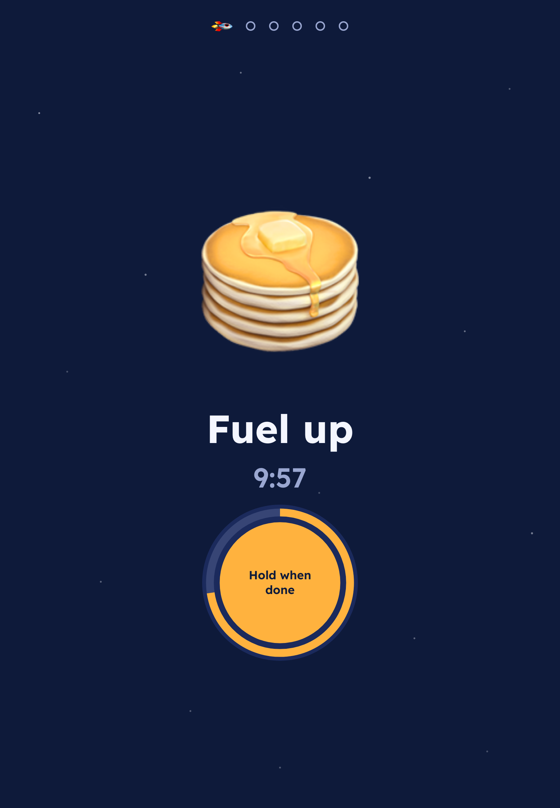
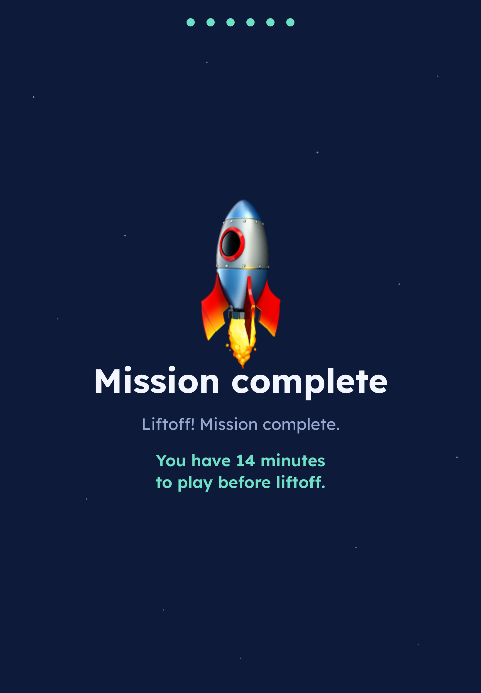
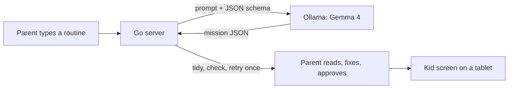
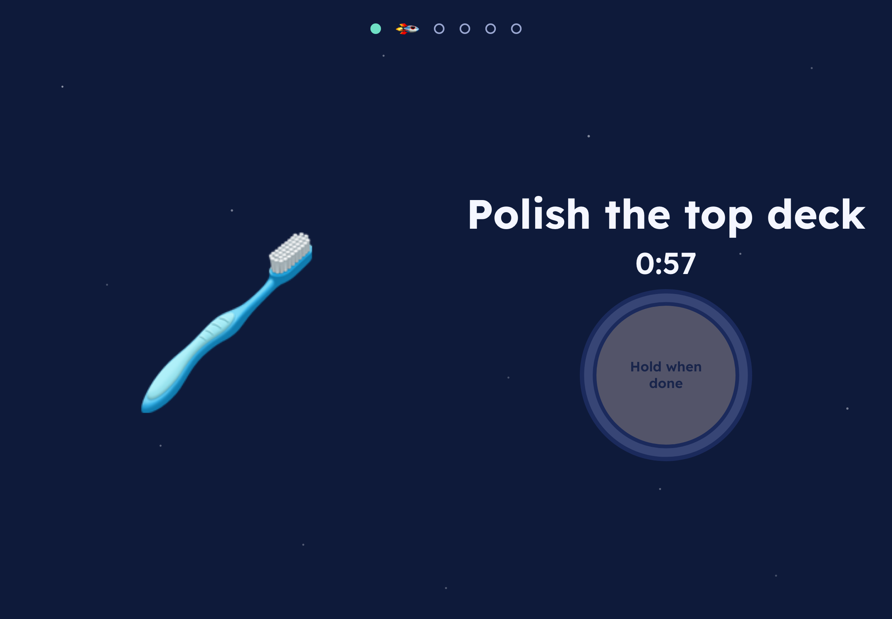
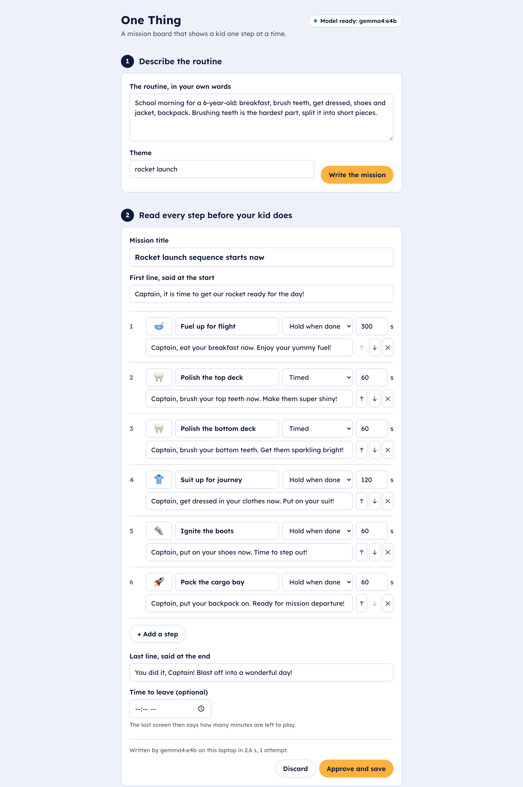

# One Thing

A mission board that shows a kid exactly one step at a time. Runs offline on Gemma.

<p>
  
  
</p>

**Try the kid screen in your browser:** [nazboyko.github.io/one-thing/demo](https://nazboyko.github.io/one-thing/demo/)
(the built-in sample only; writing new missions needs Gemma on your own computer).

## Why it exists

I built this for my six-year-old son. Routines with several steps are the
hardest part of his day: on a school morning he wants to get dressed, brush
his teeth and play all at once, and none of it gets done. A list does not
help him, so this screen never shows one.

## How it works

1. A parent describes a routine in plain words and picks a theme.
2. Gemma 4 runs on the laptop through Ollama and writes a short mission as
   JSON that has to match a schema. The server tidies it, checks every rule,
   and asks the model once more if something is off.
3. The parent reads every step, fixes anything, and approves it. Nothing
   reaches the child before that.
4. A tablet opens the mission and shows one step at a time, out loud.



## Quick start

You need [Ollama](https://ollama.com), Go 1.24+, Node 22+ and `make`
(tested with Ollama 0.35, Go 1.26 and Node 26 on macOS).

```sh
ollama pull gemma4:e4b
make run
```

Open <http://localhost:8787/> on the laptop. The terminal also prints the
address for a tablet on the same Wi-Fi, and every saved mission has its own
tablet link with a **Copy link** button. If the model is not running yet,
the parent screen says what to start and offers the built-in sample.

## The kid screen

| Rule | Why |
|---|---|
| One step on screen: one emoji, a few words, one button | A list of chores is exactly what does not work. |
| Every step is said out loud; tap the emoji to hear it again | A six-year-old may not read yet. |
| The button fires only after an 800 ms hold; an amber ring fills while it is held | Quick taps cannot skip through the routine, and finishing a step feels like a launch. |
| Two kinds of steps: "hold when done" (eating) and "timed" (brushing teeth) | For timed steps the button wakes up only when the timer ends. |
| No fail states: no red, no alarms, no points, no streaks | When time runs out, one gentle chime and "Still on it?" |
| A row of dots at the top, with a rocket on the current step | The end is always visible, so the routine feels finite. |
| A still night sky; motion only answers a touch | Calm beats exciting. With reduced motion, nothing animates. |
| A hidden way out: hold the top-left corner for 3 seconds | The parent can get back; the child does not see it. |



## The parent screen

The model writes, the parent decides. This is a real, unedited mission from
the canonical morning prompt (2.6 s on the laptop). Step 5 lost the jacket:
the kind of slip a parent fixes in step 2 before approving.



## The model

The default is `gemma4:e4b`, with thinking turned off. On an Apple M5 Max it
writes a mission in about 2 to 3 seconds, and in 22 recorded runs through
the server every mission passed validation on the first try. With thinking
on, the same request took 11 seconds and made breakfast a 10-minute timed
step, so thinking stays off.

| What | Where |
|---|---|
| System prompt | [`internal/llm/prompt.txt`](internal/llm/prompt.txt) |
| JSON schema sent as `format` | [`internal/llm/schema.json`](internal/llm/schema.json) |
| The rules every mission must pass | [`internal/mission/mission.go`](internal/mission/mission.go) |

Swap the model or the address with environment variables:

| Variable | Default |
|---|---|
| `OLLAMA_MODEL` | `gemma4:e4b` |
| `OLLAMA_URL` | `http://localhost:11434` |
| `ADDR` | `:8787` |
| `DATA_DIR` | `./data` |

```sh
OLLAMA_MODEL=gemma4:e2b make run
```

## Privacy, and what this is not

- Everything stays on the laptop: the model, the missions, the app. The only
  network call is to the local Ollama server. No accounts, no analytics, no
  fonts or scripts from the internet.
- The child never talks to the model and never sees text a parent has not
  approved. The kid screen has no text input at all.
- There is no login. It is meant for a trusted home network. Use
  `ADDR=127.0.0.1:8787` to keep it on the laptop only.
- It is a routine helper for a family. It is not a medical device or therapy.

## Limitations

- Not yet tried by the person it is for. It was built and checked in one
  evening.
- Tested in browser tablet emulation (Chrome device mode and Playwright iPad
  profiles), not on a real tablet.
- The model sometimes merges or drops an action: in about one morning run
  in three, "shoes and jacket" became just "shoes". The parent review is
  there for this.
- Speech uses the device's own voices, so it sounds different everywhere.
- A refresh starts the mission again from the beginning.
- Most browsers do not keep the screen awake on a plain-HTTP home address.
  On an iPad, set Auto-Lock to Never or use Guided Access; on Android, use
  screen pinning.

## Working on it

```sh
make dev     # Vite on :5173 with /api proxied to the Go server on :8787
make test    # Go tests and Vitest
make check   # gofmt, go vet, tests, tsc, web build
make demo    # rebuild the static kid screen demo in docs/demo
```

Add `?speed=20` to any play link (`#/play/sample?speed=20`) to run the timers
twenty times faster.

The Go server uses only the standard library. The web app uses React, and
nothing else at runtime.

## Credits

- [Gemma 4](https://deepmind.google/models/gemma/) by Google DeepMind, open weights
- [Ollama](https://ollama.com) for local inference
- [Go](https://go.dev), [React](https://react.dev), [Vite](https://vite.dev)
- [Lexend](https://www.lexend.com) font, SIL Open Font License 1.1, bundled through Fontsource

Built on October 4, 2026 for the Hacktoberfest Weekend Challenge on DEV.

## License

[MIT](LICENSE)
